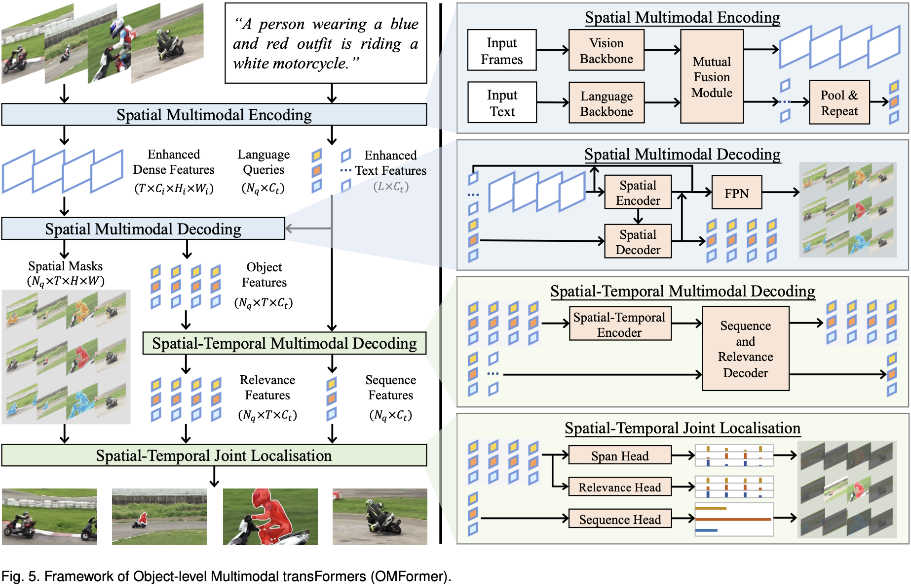

# YoURVOS
Show Me When and Where: Towards Referring Video Object Segmentation in the Wild 

## Table of Content
[1. Overview](#overview), [2. Benchmark](#benchmark), [3. Baseline (OMFormer)](#baseline)

## <span id="overview">1. Overview</span>
YoURVOS (Youtube Untrimmed Referring Video Object Segmentation) is a benchmark to close the gap between Referring Video Object Segmentation (RVOS) studies and realistic scenarios. Unlike previous RVOS benchmarks, where videos are trimmed to enable text-referred objects to always be present, YoURVOS comes from untrimmed videos. Thus, the targets could appear anytime, anywhere in a video. This poses great challenges to RVOS methods that need to show not only when but also where the objects appear in a video. 


## <span id="benchmark">2. Benchmark</span>
<table>
    <tr>
        <td>Method</td>
        <td>Venue</td>
        <td>Backbone</td>
        <td>J&F</td>
        <td>J</td>
        <td>F</td>
        <td>tIoU</td>
    </tr>
    <tr>
        <td rowspan="6"><a href="https://github.com/wjn922/ReferFormer">ReferFormer</a></td>
        <td rowspan="6">CVPR 2022</td>
        <td>ResNet-50</td>
        <td>12.0</td>
        <td>12.1</td>
        <td>11.9</td>
        <td>32.2</td>
    </tr>
    <tr>
        <td>ResNet-101</td>
        <td>22.4</td>
        <td>22.4</td>
        <td>22.4</td>
        <td>33.4</td>
    </tr>
    <tr>
        <td>Swin-T</td>
        <td>22.6</td>
        <td>22.7</td>
        <td>22.6</td>
        <td>34.1</td>
    </tr>
    <tr>
        <td>Swin-L</td>
        <td>24.9</td>
        <td>24.6</td>
        <td>25.2</td>
        <td>34.4</td>
    </tr>
    <tr>
        <td>V-Swin-T</td>
        <td>23.0</td>
        <td>22.8</td>
        <td>23.1</td>
        <td>33.7</td>
    </tr>
    <tr>
        <td>V-Swin-B</td>
        <td>24.6</td>
        <td>24.3</td>
        <td>24.8</td>
        <td>34.5</td>
    </tr>
    <tr>
        <td><a href="https://github.com/dzh19990407/LBDT">LBDT</a></td>
        <td>CVPR 2022</td>
        <td>ResNet-50</td>
        <td>14.6</td>
        <td>14.6</td>
        <td>14.5</td>
        <td>32.6</td>
    </tr>
    <tr>
        <td><a href="https://github.com/mttr2021/MTTR">MTTR</a></td>
        <td>CVPR 2022</td>
        <td>V-Swin-T</td>
        <td>21.4</td>
        <td>21.3</td>
        <td>21.6</td>
        <td>33.6</td>
    </tr>
    <tr>
        <td rowspan="3"><a href="https://github.com/MasterBin-IIAU/UNINEXT">UNINEXT</a></td>
        <td rowspan="3">CVPR 2023</td>
        <td>ResNet-50</td>
        <td>23.1</td>
        <td>22.9</td>
        <td>23.3</td>
        <td>32.6</td>
    </tr>
    <tr>
        <td>Conv-L</td>
        <td>24.2</td>
        <td>23.9</td>
        <td>24.5</td>
        <td>32.6</td>
    </tr>
    <tr>
        <td>ViT-L</td>
        <td>24.8</td>
        <td>24.4</td>
        <td>25.2</td>
        <td>32.6</td>
    </tr> 
    <tr>
        <td><a href="https://github.com/lxa9867/R2VOS">R2VOS</a></td>
        <td>ICCV 2023</td>
        <td>ResNet-50</td>
        <td>24.9</td>
        <td>25.0</td>
        <td>24.9</td>
        <td>35.3</td>
    </tr>
    <tr>
        <td><a href="https://github.com/henghuiding/MeViS">LMPM</a></td>
        <td>ICCV 2023</td>
        <td>Swin-T</td>
        <td>13.0</td>
        <td>12.8</td>
        <td>13.3</td>
        <td>21.9</td>
    </tr>
    <tr>
        <td><a href="https://github.com/hkchengrex/Tracking-Anything-with-DEVA">DEVA</a></td>
        <td>ICCV 2023</td>
        <td>Swin-L</td>
        <td>21.9</td>
        <td>21.6</td>
        <td>22.2</td>
        <td>33.6</td>
    </tr>
    <tr>
        <td rowspan="2"><a href="https://github.com/wudongming97/OnlineRefer">OnlineRefer</a></td>
        <td rowspan="2">ICCV 2023</td>
        <td>ResNet-50</td>
        <td>22.5</td>
        <td>22.4</td>
        <td>22.5</td>
        <td>33.8</td>
    </tr>
    <tr>
        <td>Swin-L</td>
        <td>25.0</td>
        <td>24.4</td>
        <td>25.6</td>
        <td>34.9</td>
    </tr>
    <tr>
        <td rowspan="2"><a href="https://github.com/bo-miao/SgMg">SgMg</a></td>
        <td rowspan="2">ICCV 2023</td>
        <td>V-Swin-T</td>
        <td>24.3</td>
        <td>24.1</td>
        <td>24.5</td>
        <td>34.4</td>
    </tr>
    <tr>
        <td>V-Swin-B</td>
        <td>25.3</td>
        <td>25.1</td>
        <td>25.5</td>
        <td>34.7</td>
    </tr>
    <tr>
        <td rowspan="2"><a href="https://github.com/RobertLuo1/NeurIPS2023_SOC">SOC</a></td>
        <td rowspan="2">NeurIPS 2023</td>
        <td>V-Swin-T</td>
        <td>23.5</td>
        <td>23.2</td>
        <td>23.8</td>
        <td>34.4</td>
    </tr>
    <tr>
        <td>V-Swin-B</td>
        <td>24.2</td>
        <td>23.8</td>
        <td>24.6</td>
        <td>33.6</td>
    </tr>
    <tr>
        <td rowspan="5"><a href="https://github.com/OpenGVLab/MUTR">MUTR</a></td>
        <td rowspan="5">AAAI 2024</td>
        <td>ResNet-50</td>
        <td>22.4</td>
        <td>22.3</td>
        <td>22.6</td>
        <td>33.3</td>
    </tr>
    <tr>
        <td>ResNet-101</td>
        <td>23.3</td>
        <td>23.1</td>
        <td>23.4</td>
        <td>33.7</td>
    </tr>
    <tr>
        <td>Swin-L</td>
        <td>26.2</td>
        <td>25.9</td>
        <td>26.5</td>
        <td>35.1</td>
    </tr>
    <tr>
        <td>V-Swin-T</td>
        <td>23.2</td>
        <td>23.1</td>
        <td>23.4</td>
        <td>33.5</td>
    </tr>
    <tr>
        <td>V-Swin-B</td>
        <td>25.7</td>
        <td>25.5</td>
        <td>26.0</td>
        <td>34.6</td>
    </tr>
    <tr>
        <td>OMFormer</td>
        <td>Ours 2024</td>
        <td>ResNet-50</td>
        <td>33.7</td>
        <td>33.6</td>
        <td>33.8</td>
        <td>44.9</td>
    </tr>
</table>

## <span id="baseline">3. Baseline (OMFormer)</span>
Object-level Multimodal transFormers (OMFormer) for RVOS.

### Install and Run
We test the code on Python=3.9, PyTorch=1.10.1, CUDA=11.3
```bash
cd baseline
pip install -r requirements.txt
cd models/ops
python setup.py build install
cd ../..
```
```bash
python inference_yourvos.py \
  --freeze_text_encoder \
  --output_dir [path to output] \
  --resume [path to checkpoint]/omformer_r50.pth \
  --ngpu [number of gpus] \
  --batch_size 1 \
  --backbone resnet50 \
  --yourvos_path [path to YoURVOS]
```
Checkpoint (Anonymous link on Google Drive): [omformer_r50.pth](https://drive.google.com/drive/folders/1uK6TXXr-zB-YXyq3gIKhpS311390wy6N?usp=share_link)

YoURVOS test videos (Anonymous link on Google Drive): [YoURVOS](https://drive.google.com/drive/folders/1uK6TXXr-zB-YXyq3gIKhpS311390wy6N?usp=share_link)

### Evaluate
```bash
cd evaluation/vos-benchmark
# J&F
python benchmark.py -g [path to gt] -m [path to predicts] --do_not_skip_first_and_last_frame
# tIoU
python tiou.py [path to predicts] spans.txt
```

### Framework


